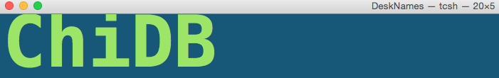
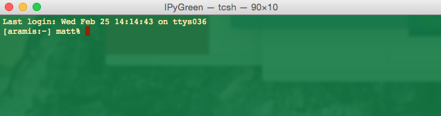

# shellScripts
**My personal collection of useful shell scripts**

[](https://github.com/mattgiguere/shellScripts/blob/master/LICENSE)

###Descriptions
---------------------------------
- **newdwin**: a very simple one line script to create a new Terminal window with my "DeskNames" settings using `term.sh`. Here's the result:

With many projects going at the same time, and many desktops open, it is difficult to know which desktop is which. I put this window in the corner of every desktop to keep track of my desktops. The large font allows me to read the desktop names in Mission Control mode.

- **newiwin**: one liner that creates my default windows for launching IPython Notebooks. With typically dozens of Terminal windows open, I find a little bit of custom color coding for each window type speeds up finding the window I'm looking for, increasing productivity.

- **term.sh**: A script for opening a new Mac OS X terminal window with the desired command, window settings, size, and position. It is based on [David Moles' response](http://stackoverflow.com/a/28373404/3854235) to [this](http://stackoverflow.com/questions/4404242/programmatically-launch-terminal-app-with-a-specified-command-and-custom-colors) [stackoverflow](stackoverflow.com) question, but tweaked to optionally set the size and position. The syntax is

    ```sh
    term.sh "command" "window settings" width height y-position x-position
    ```
    For example
    ```sh
    term.sh "echo 'hello world'" "Novel" 640 320 500 50
    ```
